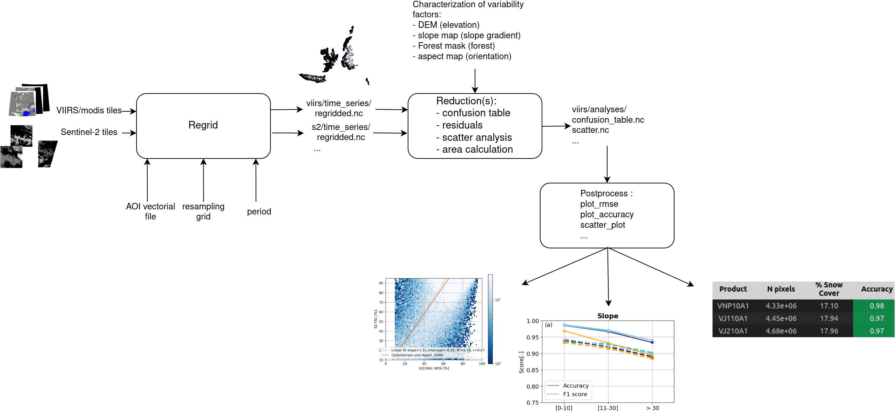

# viirsnow

Assess VIIRS and other moderate resolution satellite snow cover products using a Sentinel-2 as higher-resolution reference.

## Description

This project contains a set of tools to perform a large scale comparison of satellite snow cover products, i.e. the codes developed for the work in [1].

The aim is to provide a set of independent blocks that limit manual operations and that adapt to different scales. These codes can be used to replicate [1] to other study areas and can be adapted to other datasets.

 

Products supported:
- V[NP|J1|J2]10A1 (NSIDC VIIRS L3 snow cover)
- MOD10A1 (NSIDC MODIS Terra L3 snow cover)
- MF-FSC-L3 (Météo-France VIIRS covering France)

## Installtion

```bash
git clone https://github.com/nicolaimpe/viirsnow.git
cd viirsnow
pip install .
```
## Usage

See `launch_reduction.py` and `launch_regrid.py` for use of Python tools to launch an analysis.
See `article_illustrations.ipynb` for visualization.

## Code organization

```bash
$ tree
├── notebooks
│   └── article_illustrations.ipynb : code used for illustration generation for [1]
├── output_folder
├── pdm.lock
├── pyproject.toml
├── README.md
├── scripts
│   ├── launch_reduction.py         : main to automize reduction for combination of products and reductions
│   └── launch_regrid.py            : main to automize regridding for multiple products
├── src
│   ├── fractional_snow_cover.py    : NDSI to FSC equations
│   ├── postprocess                 : postprocess block: compute metrics, print and plot from reduced datasets
│   ├── products                    : gather information about supported snow cover products
│   ├── reductions                  : reduction block: from two datasets on the same grid, compute differences and correspondences
│   └── regrid                      : regrid block: mosaic, resample, stack, crop snow cover data into a uniform time series
```

## Cite 
[1] N. Imperatore et al., ‘Assessing VIIRS constellation seasonal snow cover over the French mountains with Sentinel-2’, EGUsphere, pp. 1–27, Mar. 2026, doi: 10.5194/egusphere-2026-1122.
