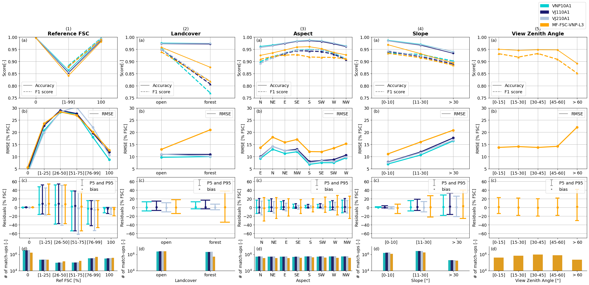
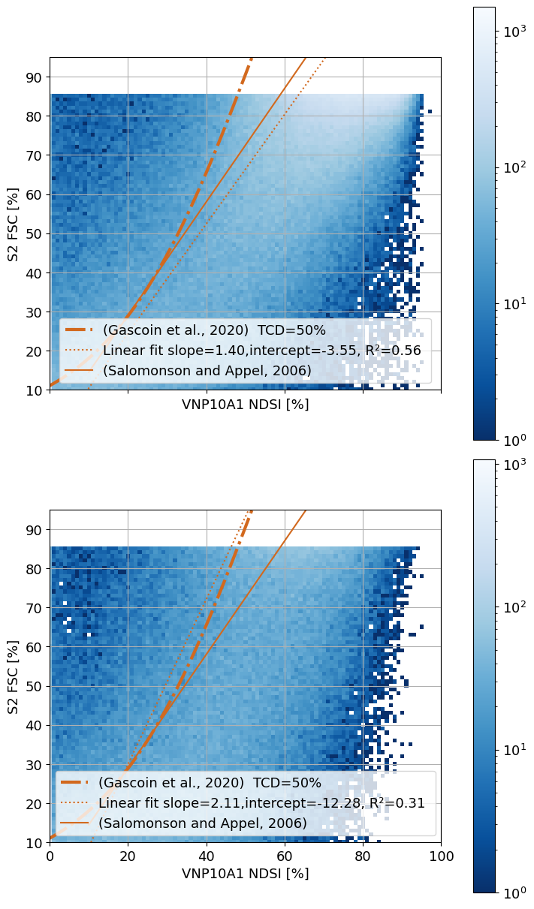
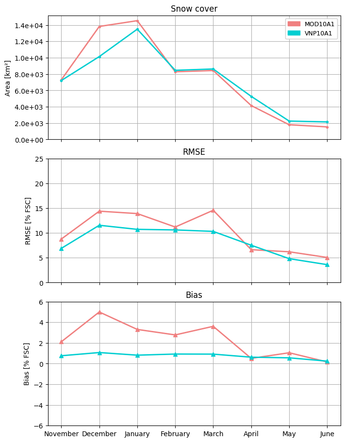
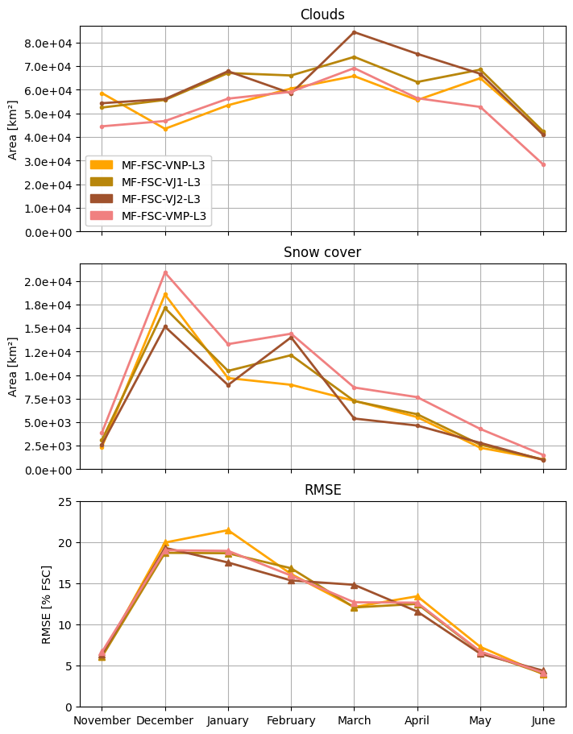

```python
from typing import List
from matplotlib import pyplot as plt
from matplotlib.axes import Axes
from postprocess.error_distribution import line_plot_rmse, plot_error_bars
import matplotlib.patches as mpatches
from postprocess.skill_scores import barplot_total_count, line_plot_accuracy_f1_score

from postprocess.general_purpose import AnalysisContainer
from products.snow_cover_product import MeteoFranceEvalSNPP

from copy import deepcopy

numbers_alphabet_dict = {0: "(a)", 1: "(b)", 2: "(c)", 3: "(d)", 4: "(e)", 5: "(f)"}


def plot_one_var_analysis(analysis: AnalysisContainer, analysis_var: str, axs: List[Axes]):
    titles_dict = {
        "Ref FSC [%]": "Reference FSC",
        "Aspect": "Aspect",
        "Landcover": "Landcover",
        "Slope [°]": "Slope",
        "View Zenith Angle [°]": "View Zenith Angle",
    }

    axs[0].set_title(titles_dict[analysis_var], fontweight="bold")
    if analysis_var == "View Zenith Angle [°]":
        analysis_sza = deepcopy(analysis)
        analysis_sza.products = [MeteoFranceEvalSNPP()]
        analysis = analysis_sza
    line_plot_accuracy_f1_score(analysis=analysis, analysis_var=analysis_var, ax=axs[0])
    line_plot_rmse(analysis=analysis, analysis_var=analysis_var, ax=axs[1])
    plot_error_bars(analysis=analysis, analysis_var=analysis_var, ax=axs[2])
    barplot_total_count(analysis=analysis, analysis_var=analysis_var, ax=axs[-1])


def plot_grid(analysis: AnalysisContainer, params_list: List[str], axs: List[Axes]):

    for i, var in enumerate(params_list):
        axs[0, i].text(
            0.5, 1.17, f"({i + 1})", horizontalalignment="center", verticalalignment="top", transform=axs[0, i].transAxes
        )
        for j in range(len(axs[:, i])):
            axs[j, i].text(
                0.02,
                0.98,
                numbers_alphabet_dict[j],
                horizontalalignment="left",
                verticalalignment="top",
                transform=axs[j, i].transAxes,
            )

        plot_one_var_analysis(analysis, var, axs[:, i])

```


```python
from products.snow_cover_product import MeteoFranceEvalSNPP, VNP10A1, VJ110A1, VJ210A1
from postprocess.general_purpose import AnalysisContainer
from winter_year import WinterYear
from geospatial_grid.grid_database import UTM375mGrid


analysis = AnalysisContainer(
    products=[VNP10A1(), VJ110A1(), VJ210A1(), MeteoFranceEvalSNPP()],
    analysis_folder="/home/imperatoren/work/VIIRS_S2_comparison/viirsnow/output_folder/version_11/",
    winter_year=WinterYear(2023, 2024),
    grid=UTM375mGrid(),
)
```


```python
plt.rcParams["font.size"] = 13
params = ["Ref FSC [%]", "Landcover", "Aspect", "Slope [°]", "View Zenith Angle [°]"]
# params = ["Landcover","Aspect"]
fig, axs = plt.subplots(
    4, len(params), figsize=(5 * len(params), 11), layout="constrained", gridspec_kw={"height_ratios": [2, 2, 2, 0.8]}
)
plot_grid(analysis=analysis, params_list=params, axs=axs)
custom_leg = [mpatches.Patch(color=product.plot_color, label=product.prod_id) for product in analysis.products]
fig.legend(handles=custom_leg, bbox_to_anchor=(1, 1.1))
# fig.savefig("/home/imperatoren/work/VIIRS_S2_comparison/article/synthesis_scores_plot.eps", format="eps", bbox_inches="tight")
```


    <matplotlib.legend.Legend at 0x72a5041ccf80>


    

    


```python
### NDSI-FSC regression
from matplotlib import cm, colors
from matplotlib.axes import Axes
from matplotlib.figure import Figure
import numpy as np
from fractional_snow_cover import gascoin, salomonson_appel

# from postprocess.scatter_plot import fancy_scatter_plot
import xarray as xr
import matplotlib.pyplot as plt
from ndsi_fsc_calibration.visualization import scatter_plot_with_fit

analysis_type = "scatter"
analysis_folder = (
    "/home/imperatoren/work/VIIRS_S2_comparison/viirsnow/output_folder/version_11/wy_2023_2024/vnp10a1_utm_375m/analyses/"
)

nasa_l3_snpp_metrics_ds = xr.open_dataset(f"{analysis_folder}/scatter.nc")
nasa_l3_snpp_metrics_ds = nasa_l3_snpp_metrics_ds.rename({"ref_fsc_min": "fsc", "eval_bins": "ndsi"}).swap_dims(
    {"ref_fsc_bins": "fsc"}
)

fig, ax = plt.subplots(2, 1, figsize=(7, 12), sharex=True, layout="constrained")
plt.subplots_adjust(bottom=0.05, right=0.5)


FOREST_TITLE = {
    "open": "Open",
    "forest": "Forest",
}
for i, fore in enumerate(["open", "forest"]):
    n_min = 0
    # fig.suptitle("VNP10A1 NDSI_Snow_Cover vs Reference FSC (Sentinel-2)", fontsize=14)
    reduced = (
        nasa_l3_snpp_metrics_ds.sel(landcover=[fore])
        .sum(dim=("landcover", "time", "altitude_bins", "aspect"))
        .data_vars["n_occurrences"]
    )

    xax = reduced.ndsi.values
    f_veg = 0 if fore == "no_forest" else 0.5
    fit_g = gascoin(xax * 0.01, f_veg=f_veg) * 100

    # ax[i].plot(xax, salomonson_appel(xax), color="chocolate", linewidth=3, label="(Salomonson and Appel, 2006)")
    ax[i].plot(xax, fit_g, "-.", color="chocolate", linewidth=3, label=f"(Gascoin et al., 2020)  TCD={int(f_veg * 100)}%")

    scatter_plot = scatter_plot_with_fit(
        data=reduced,
        eval_prod_name="VNP10A1",
        ax=ax[i],
        fig=fig,
        quantile_min=0,
        quantile_max=1,
        fsc_min=10,
        fsc_max=95,
    )

    # pcc = compute_correlation_coefficient_from_weights(reduced.rename({"ref_bins": "y", "test_bins": "x"}))
    # ax[i].set_title(PRODUCT_PLOT_NAMES[k])
    # ax[i].set_ylabel("S2 FSC [%]")
    # ax[i].set_xlabel("VNP10A1 NDSI [%]")
    # ax[i].set_title(f"{FOREST_TITLE[fore]} R={pcc:.2f}", fontsize=14)
    # ax[i].set_ylim(10, 95)
    ax[i].set_xlim(0, 100)
    # ax[i].set_facecolor("gray")

plt.rcParams["font.size"] = 12
plt.show()


fig.patch.set_alpha(0.0)
# fig.savefig("/home/imperatoren/work/VIIRS_S2_comparison/article/scatter_plot_vert.pdf", format="pdf", dpi=600)
```

    /tmp/ipykernel_51357/656852208.py:24: UserWarning: This figure was using a layout engine that is incompatible with subplots_adjust and/or tight_layout; not calling subplots_adjust.
      plt.subplots_adjust(bottom=0.05, right=0.5)


    

    


```python
from matplotlib import patches

from postprocess.class_distribution import annual_area_fancy_plot
from products.snow_cover_product import MOD10A1, VNP10A1
from regrid.modis_l3_to_time_series import UTM500mGrid
from winter_year import WinterYear
from postprocess.general_purpose import AnalysisContainer
import matplotlib.pyplot as plt

plt.rcParams["font.size"] = 10

analysis_folder = "/home/imperatoren/work/VIIRS_S2_comparison/viirsnow/output_folder/version_11/"
analysis = AnalysisContainer(
    products=[MOD10A1(), VNP10A1()], analysis_folder=analysis_folder, winter_year=WinterYear(2023, 2024), grid=UTM500mGrid()
)

c = ["snow_cover"]
s = ["rmse", "bias"]
n_classes = len(c)
n_scores = len(s)
n_tot = n_classes + n_scores
fig, axs = plt.subplots(n_tot, figsize=(7, 3 * n_tot), sharex=True, layout="constrained")

custom_leg = [patches.Patch(color=product.plot_color, label=product.prod_id) for product in analysis.products]
product_legend = axs[0].legend(handles=custom_leg, fontsize=9)
axs[0].add_artist(product_legend)

annual_area_fancy_plot(analysis=analysis, classes=c, scores=s, axes=axs)
fig.show()
# fig.savefig("/home/imperatoren/work/VIIRS_S2_comparison/article/modis.eps", format="eps", bbox_inches="tight")

```

    /tmp/ipykernel_51357/2192862028.py:29: UserWarning: FigureCanvasAgg is non-interactive, and thus cannot be shown
      fig.show()


    

    


```python
from products.snow_cover_product import MeteoFranceEvalSNPP, MeteoFranceEvalJPSS1, MeteoFranceEvalJPSS2, MeteoFranceComposite
from matplotlib import pyplot as plt
from winter_year import WinterYear
from geospatial_grid.grid_database import UTM375mGrid
from postprocess.general_purpose import AnalysisContainer
import matplotlib.patches as patches
from postprocess.class_distribution import annual_area_fancy_plot

plt.rcParams["font.size"] = 10

analysis_folder = "/home/imperatoren/work/VIIRS_S2_comparison/viirsnow/output_folder/version_11/"
product_list = [MeteoFranceEvalSNPP(), MeteoFranceEvalJPSS1(), MeteoFranceEvalJPSS2(), MeteoFranceComposite()]
analysis = AnalysisContainer(
    products=product_list, analysis_folder=analysis_folder, winter_year=WinterYear(2024, 2025), grid=UTM375mGrid()
)

c = ["clouds", "snow_cover"]
s = ["rmse"]
n_classes = len(c)
n_scores = len(s)
n_tot = n_classes + n_scores
fig, axs = plt.subplots(n_tot, figsize=(7, 3 * n_tot), sharex=True, layout="constrained")

custom_leg = [patches.Patch(color=product.plot_color, label=product.prod_id) for product in analysis.products]
product_legend = axs[0].legend(handles=custom_leg, fontsize=10)
axs[0].add_artist(product_legend)

annual_area_fancy_plot(analysis=analysis, classes=c, scores=s, axes=axs)
fig.show()
fig.patch.set_alpha(0.0)
# fig.savefig(
#     "/home/imperatoren/work/VIIRS_S2_comparison/article/multiplatform.eps",
#     format="eps",
#     bbox_inches="tight",
# )
```

    /tmp/ipykernel_51357/3967801763.py:29: UserWarning: FigureCanvasAgg is non-interactive, and thus cannot be shown
      fig.show()


    

    


```python
import pandas as pd
from postprocess.error_distribution import compute_uncertainty_results_df, fancy_table_tot
from postprocess.general_purpose import open_reduced_dataset
from postprocess.skill_scores import compute_contingency_results_df, compute_n_pixels_results_df
from products.snow_cover_product import MeteoFranceEvalSNPP, VJ210A1, VNP10A1, VJ110A1
from winter_year import WinterYear
from geospatial_grid.grid_database import UTM375mGrid

product_list = [VNP10A1(), VJ110A1(), VJ210A1(), MeteoFranceEvalSNPP()]
winter_year = WinterYear(2023, 2024)
grid = UTM375mGrid()
# refs = ['1-99', '0-100']
analysis_folder = "/home/imperatoren/work/VIIRS_S2_comparison/viirsnow/output_folder/version_11/"
df_list = []
selection = dict(altitude_min=slice(900, None))
uncertainty_list = [
    open_reduced_dataset(
        prod, analysis_folder=analysis_folder, winter_year=winter_year, analysis_type="uncertainty", grid=grid
    )
    .set_xindex("altitude_min")
    .sel(selection)
    for prod in product_list
]
confusion_table_list = [
    open_reduced_dataset(
        prod, analysis_folder=analysis_folder, winter_year=winter_year, analysis_type="confusion_table", grid=grid
    )
    .set_xindex("altitude_min")
    .sel(selection)
    for prod in product_list
]
df_cont = compute_contingency_results_df(snow_cover_products=product_list, metric_datasets=confusion_table_list)
# df_cont["Reference"] = refs[i]
df_unc = compute_uncertainty_results_df(snow_cover_products=product_list, metric_datasets=uncertainty_list)[["bias", "rmse"]]
df_n_pixels = compute_n_pixels_results_df(snow_cover_products=product_list, metric_datasets=confusion_table_list)[
    ["n_tot_pixels", "n_snow_pixels"]
]
df_n_pixels["percentage_snow_pixels"] = df_n_pixels["n_snow_pixels"] / df_n_pixels["n_tot_pixels"] * 100
df_n_pixels = df_n_pixels[["n_tot_pixels", "percentage_snow_pixels"]]

df_tot = pd.concat(
    [
        df_cont[["product"]],
        df_n_pixels,
        df_cont[["accuracy", "f1_score", "commission_error", "omission_error"]],
        df_unc,
    ],
    axis=1,
)


df_tot = df_tot.rename(
    columns={
        "product": "Product",
        "n_tot_pixels": "N pixels",
        "percentage_snow_pixels": "% Snow Cover",
        "accuracy": "Accuracy",
        "f1_score": "F1-score",
        "commission_error": "Commission Error",
        "omission_error": "Omission Error",
        "bias": "Bias [%]",
        "rmse": "RMSE [%]",
    }
)


df_list.append(df_tot)


df_resume = pd.concat(df_list, ignore_index=True)


styled = fancy_table_tot(df_resume)

display(styled)
```


<style type="text/css">
#T_228ca th {
  background-color: lightgrey;
  color: black;
  font-weight: bold;
  width: 75px;
  text-align: center;
  text-usetex: True;
}
#T_228ca_row0_col0, #T_228ca_row0_col1, #T_228ca_row0_col2, #T_228ca_row1_col0, #T_228ca_row1_col1, #T_228ca_row1_col2, #T_228ca_row2_col0, #T_228ca_row2_col1, #T_228ca_row2_col2, #T_228ca_row3_col0, #T_228ca_row3_col1, #T_228ca_row3_col2 {
  align: center;
  text-align: center;
}
#T_228ca_row0_col3 {
  background-color: #0f8446;
  color: #f1f1f1;
  align: center;
  text-align: center;
}
#T_228ca_row0_col4, #T_228ca_row2_col4 {
  background-color: #57b65f;
  color: #f1f1f1;
  align: center;
  text-align: center;
}
#T_228ca_row0_col5 {
  background-color: #0e8245;
  color: #f1f1f1;
  align: center;
  text-align: center;
}
#T_228ca_row0_col6, #T_228ca_row1_col6, #T_228ca_row3_col4 {
  background-color: #69be63;
  color: #f1f1f1;
  align: center;
  text-align: center;
}
#T_228ca_row0_col7 {
  background-color: #368854;
  color: #f1f1f1;
  align: center;
  text-align: center;
}
#T_228ca_row0_col8 {
  background-color: #60ba62;
  color: #f1f1f1;
  align: center;
  text-align: center;
}
#T_228ca_row1_col3, #T_228ca_row1_col5 {
  background-color: #118848;
  color: #f1f1f1;
  align: center;
  text-align: center;
}
#T_228ca_row1_col4 {
  background-color: #5db961;
  color: #f1f1f1;
  align: center;
  text-align: center;
}
#T_228ca_row1_col7 {
  background-color: #529862;
  color: #f1f1f1;
  align: center;
  text-align: center;
}
#T_228ca_row1_col8 {
  background-color: #7dc765;
  color: #000000;
  align: center;
  text-align: center;
}
#T_228ca_row2_col3 {
  background-color: #108647;
  color: #f1f1f1;
  align: center;
  text-align: center;
}
#T_228ca_row2_col5 {
  background-color: #0d8044;
  color: #f1f1f1;
  align: center;
  text-align: center;
}
#T_228ca_row2_col6 {
  background-color: #84ca66;
  color: #000000;
  align: center;
  text-align: center;
}
#T_228ca_row2_col7 {
  background-color: #026938;
  color: #f1f1f1;
  align: center;
  text-align: center;
}
#T_228ca_row2_col8 {
  background-color: #75c465;
  color: #000000;
  align: center;
  text-align: center;
}
#T_228ca_row3_col3 {
  background-color: #39a758;
  color: #f1f1f1;
  align: center;
  text-align: center;
}
#T_228ca_row3_col5 {
  background-color: #42ac5a;
  color: #f1f1f1;
  align: center;
  text-align: center;
}
#T_228ca_row3_col6 {
  background-color: #8ccd67;
  color: #000000;
  align: center;
  text-align: center;
}
#T_228ca_row3_col7 {
  background-color: #2a814d;
  color: #f1f1f1;
  align: center;
  text-align: center;
}
#T_228ca_row3_col8 {
  background-color: #d3ec87;
  color: #000000;
  align: center;
  text-align: center;
}
</style>
<table id="T_228ca">
  <thead>
    <tr>
      <th id="T_228ca_level0_col0" class="col_heading level0 col0" >Product</th>
      <th id="T_228ca_level0_col1" class="col_heading level0 col1" >N pixels</th>
      <th id="T_228ca_level0_col2" class="col_heading level0 col2" >% Snow Cover</th>
      <th id="T_228ca_level0_col3" class="col_heading level0 col3" >Accuracy</th>
      <th id="T_228ca_level0_col4" class="col_heading level0 col4" >F1-score</th>
      <th id="T_228ca_level0_col5" class="col_heading level0 col5" >Commission Error</th>
      <th id="T_228ca_level0_col6" class="col_heading level0 col6" >Omission Error</th>
      <th id="T_228ca_level0_col7" class="col_heading level0 col7" >Bias [%]</th>
      <th id="T_228ca_level0_col8" class="col_heading level0 col8" >RMSE [%]</th>
    </tr>
  </thead>
  <tbody>
    <tr>
      <td id="T_228ca_row0_col0" class="data row0 col0" >VNP10A1</td>
      <td id="T_228ca_row0_col1" class="data row0 col1" >4.33e+06</td>
      <td id="T_228ca_row0_col2" class="data row0 col2" >17.10</td>
      <td id="T_228ca_row0_col3" class="data row0 col3" >0.98</td>
      <td id="T_228ca_row0_col4" class="data row0 col4" >0.93</td>
      <td id="T_228ca_row0_col5" class="data row0 col5" >0.02</td>
      <td id="T_228ca_row0_col6" class="data row0 col6" >0.06</td>
      <td id="T_228ca_row0_col7" class="data row0 col7" >0.53</td>
      <td id="T_228ca_row0_col8" class="data row0 col8" >9.83</td>
    </tr>
    <tr>
      <td id="T_228ca_row1_col0" class="data row1 col0" >VJ110A1</td>
      <td id="T_228ca_row1_col1" class="data row1 col1" >4.45e+06</td>
      <td id="T_228ca_row1_col2" class="data row1 col2" >17.94</td>
      <td id="T_228ca_row1_col3" class="data row1 col3" >0.97</td>
      <td id="T_228ca_row1_col4" class="data row1 col4" >0.92</td>
      <td id="T_228ca_row1_col5" class="data row1 col5" >0.02</td>
      <td id="T_228ca_row1_col6" class="data row1 col6" >0.06</td>
      <td id="T_228ca_row1_col7" class="data row1 col7" >0.80</td>
      <td id="T_228ca_row1_col8" class="data row1 col8" >10.88</td>
    </tr>
    <tr>
      <td id="T_228ca_row2_col0" class="data row2 col0" >VJ210A1</td>
      <td id="T_228ca_row2_col1" class="data row2 col1" >4.68e+06</td>
      <td id="T_228ca_row2_col2" class="data row2 col2" >17.96</td>
      <td id="T_228ca_row2_col3" class="data row2 col3" >0.97</td>
      <td id="T_228ca_row2_col4" class="data row2 col4" >0.93</td>
      <td id="T_228ca_row2_col5" class="data row2 col5" >0.02</td>
      <td id="T_228ca_row2_col6" class="data row2 col6" >0.07</td>
      <td id="T_228ca_row2_col7" class="data row2 col7" >-0.03</td>
      <td id="T_228ca_row2_col8" class="data row2 col8" >10.57</td>
    </tr>
    <tr>
      <td id="T_228ca_row3_col0" class="data row3 col0" >MF-FSC-VNP-L3</td>
      <td id="T_228ca_row3_col1" class="data row3 col1" >3.09e+06</td>
      <td id="T_228ca_row3_col2" class="data row3 col2" >34.15</td>
      <td id="T_228ca_row3_col3" class="data row3 col3" >0.94</td>
      <td id="T_228ca_row3_col4" class="data row3 col4" >0.92</td>
      <td id="T_228ca_row3_col5" class="data row3 col5" >0.05</td>
      <td id="T_228ca_row3_col6" class="data row3 col6" >0.08</td>
      <td id="T_228ca_row3_col7" class="data row3 col7" >0.41</td>
      <td id="T_228ca_row3_col8" class="data row3 col8" >14.73</td>
    </tr>
  </tbody>
</table>


```python
import pandas as pd

from postprocess.error_distribution import compute_uncertainty_results_df, fancy_table_tot
from postprocess.general_purpose import open_reduced_dataset
from postprocess.skill_scores import compute_contingency_results_df, compute_n_pixels_results_df
from products.snow_cover_product import VJ110A1, VNP10A1, MeteoFranceEvalSNPP

# import dataframe_image as dfi
from winter_year import WinterYear
from IPython.display import display

from products.snow_cover_product import VNP10A1
from geospatial_grid.grid_database import UTM375mGrid


analysis_folder = "/home/imperatoren/work/VIIRS_S2_comparison/viirsnow/output_folder/version_11/"

product_list = [VNP10A1()]
winter_year = WinterYear(2023, 2024)
grid = UTM375mGrid()
df_list = []

refs = ["1-99 \%", "0-100 \%"]

for i, ref in enumerate([slice(26, 100), slice(None, None)]):
    for f in ["forest", "open"]:
        for asp in ["N", "S"]:
            # for t in [ '2023-12',  '2024-04']:
            # print(f,asp,ref)
            selection = dict(altitude_min=slice(900, None), ref_fsc_max=ref, landcover=f, aspect=asp)
            uncertainty_list = [
                open_reduced_dataset(
                    prod, analysis_folder=analysis_folder, analysis_type="uncertainty", winter_year=winter_year, grid=grid
                )
                .set_xindex("altitude_min")
                .set_xindex("ref_fsc_max")
                .sel(selection)
                for prod in product_list
            ]
            confusion_table_list = [
                open_reduced_dataset(
                    prod, analysis_folder=analysis_folder, analysis_type="confusion_table", winter_year=winter_year, grid=grid
                )
                .set_xindex("altitude_min")
                .set_xindex("ref_fsc_max")
                .sel(selection)
                for prod in product_list
            ]
            df_cont = compute_contingency_results_df(snow_cover_products=product_list, metric_datasets=confusion_table_list)
            df_cont["Reference FSC"] = refs[i]
            df_unc = compute_uncertainty_results_df(snow_cover_products=product_list, metric_datasets=uncertainty_list)[
                ["bias", "rmse"]
            ]
            df_n_pixels = compute_n_pixels_results_df(snow_cover_products=product_list, metric_datasets=confusion_table_list)[
                ["n_tot_pixels", "n_snow_pixels"]
            ]
            df_n_pixels["percentage_snow_pixels"] = df_n_pixels["n_snow_pixels"] / df_n_pixels["n_tot_pixels"] * 100
            df_n_pixels = df_n_pixels[["n_tot_pixels", "percentage_snow_pixels"]]

            df_tot = pd.concat(
                [
                    df_cont[["Reference FSC", "landcover", "aspect"]],
                    df_n_pixels,
                    df_cont[["accuracy", "f1_score", "commission_error", "omission_error"]],
                    df_unc,
                ],
                axis=1,
            )

            df_tot = df_tot.rename(
                columns={
                    "landcover": "Landcover",
                    "aspect": "Aspect",
                    "n_tot_pixels": "N pixels",
                    "percentage_snow_pixels": "% Snow Cover",
                    "accuracy": "Accuracy",
                    "f1_score": "F1-score",
                    "commission_error": "Commission Error",
                    "omission_error": "Omission Error",
                    "bias": "Bias [%]",
                    "rmse": "RMSE [%]",
                }
            )

            if df_tot.loc[0, "Landcover"] == "forest":
                df_tot["Landcover"] = "Forest"
            elif df_tot.loc[0, "Landcover"] == "no_forest":
                df_tot["Landcover"] = "Open"
            df_list.append(df_tot)
            # print(df_tot)
            # print("Worse")
            # fancy_table_skill_scores(df)


df_resume = pd.concat(df_list, ignore_index=True)
styled = fancy_table_tot(df_resume)

print("VNP10A1 2023/2024")
display(styled)
# dfi.export(styled, "/home/imperatoren/work/VIIRS_S2_comparison/article/illustrations/table_vnp10a1.pdf", table_conversion="selenium")

```

    <>:24: SyntaxWarning: invalid escape sequence '\%'
    <>:24: SyntaxWarning: invalid escape sequence '\%'
    <>:24: SyntaxWarning: invalid escape sequence '\%'
    <>:24: SyntaxWarning: invalid escape sequence '\%'
    /tmp/ipykernel_8211/1916320634.py:24: SyntaxWarning: invalid escape sequence '\%'
      refs = ["1-99 \%", "0-100 \%"]
    /tmp/ipykernel_8211/1916320634.py:24: SyntaxWarning: invalid escape sequence '\%'
      refs = ["1-99 \%", "0-100 \%"]


    VNP10A1 2023/2024


<style type="text/css">
#T_556f0 th {
  background-color: lightgrey;
  color: black;
  font-weight: bold;
  width: 75px;
  text-align: center;
  text-usetex: True;
}
#T_556f0_row0_col0, #T_556f0_row0_col1, #T_556f0_row0_col2, #T_556f0_row0_col3, #T_556f0_row0_col4, #T_556f0_row1_col0, #T_556f0_row1_col1, #T_556f0_row1_col2, #T_556f0_row1_col3, #T_556f0_row1_col4, #T_556f0_row2_col0, #T_556f0_row2_col1, #T_556f0_row2_col2, #T_556f0_row2_col3, #T_556f0_row2_col4, #T_556f0_row3_col0, #T_556f0_row3_col1, #T_556f0_row3_col2, #T_556f0_row3_col3, #T_556f0_row3_col4, #T_556f0_row4_col0, #T_556f0_row4_col1, #T_556f0_row4_col2, #T_556f0_row4_col3, #T_556f0_row4_col4, #T_556f0_row5_col0, #T_556f0_row5_col1, #T_556f0_row5_col2, #T_556f0_row5_col3, #T_556f0_row5_col4, #T_556f0_row6_col0, #T_556f0_row6_col1, #T_556f0_row6_col2, #T_556f0_row6_col3, #T_556f0_row6_col4, #T_556f0_row7_col0, #T_556f0_row7_col1, #T_556f0_row7_col2, #T_556f0_row7_col3, #T_556f0_row7_col4 {
  align: center;
  text-align: center;
}
#T_556f0_row0_col5 {
  background-color: #fee695;
  color: #000000;
  align: center;
  text-align: center;
}
#T_556f0_row0_col6 {
  background-color: #f7814c;
  color: #f1f1f1;
  align: center;
  text-align: center;
}
#T_556f0_row0_col7 {
  background-color: #fec877;
  color: #000000;
  align: center;
  text-align: center;
}
#T_556f0_row0_col8, #T_556f0_row0_col10 {
  background-color: #ad0826;
  color: #f1f1f1;
  align: center;
  text-align: center;
}
#T_556f0_row0_col9 {
  background-color: #62a26b;
  color: #f1f1f1;
  align: center;
  text-align: center;
}
#T_556f0_row1_col5 {
  background-color: #dff293;
  color: #000000;
  align: center;
  text-align: center;
}
#T_556f0_row1_col6 {
  background-color: #fffcba;
  color: #000000;
  align: center;
  text-align: center;
}
#T_556f0_row1_col7 {
  background-color: #fffdbc;
  color: #000000;
  align: center;
  text-align: center;
}
#T_556f0_row1_col8 {
  background-color: #fed481;
  color: #000000;
  align: center;
  text-align: center;
}
#T_556f0_row1_col9 {
  background-color: #026938;
  color: #f1f1f1;
  align: center;
  text-align: center;
}
#T_556f0_row1_col10 {
  background-color: #fdb768;
  color: #000000;
  align: center;
  text-align: center;
}
#T_556f0_row2_col5 {
  background-color: #bbe278;
  color: #000000;
  align: center;
  text-align: center;
}
#T_556f0_row2_col6 {
  background-color: #8ccd67;
  color: #000000;
  align: center;
  text-align: center;
}
#T_556f0_row2_col7 {
  background-color: #fff0a6;
  color: #000000;
  align: center;
  text-align: center;
}
#T_556f0_row2_col8 {
  background-color: #dcf08f;
  color: #000000;
  align: center;
  text-align: center;
}
#T_556f0_row2_col9 {
  background-color: #b9d699;
  color: #000000;
  align: center;
  text-align: center;
}
#T_556f0_row2_col10 {
  background-color: #fb9d59;
  color: #000000;
  align: center;
  text-align: center;
}
#T_556f0_row3_col5, #T_556f0_row6_col8 {
  background-color: #75c465;
  color: #000000;
  align: center;
  text-align: center;
}
#T_556f0_row3_col6 {
  background-color: #4eb15d;
  color: #f1f1f1;
  align: center;
  text-align: center;
}
#T_556f0_row3_col7 {
  background-color: #fee797;
  color: #000000;
  align: center;
  text-align: center;
}
#T_556f0_row3_col8 {
  background-color: #39a758;
  color: #f1f1f1;
  align: center;
  text-align: center;
}
#T_556f0_row3_col9 {
  background-color: #cb6c66;
  color: #f1f1f1;
  align: center;
  text-align: center;
}
#T_556f0_row3_col10 {
  background-color: #fffbb8;
  color: #000000;
  align: center;
  text-align: center;
}
#T_556f0_row4_col5, #T_556f0_row6_col5 {
  background-color: #18954f;
  color: #f1f1f1;
  align: center;
  text-align: center;
}
#T_556f0_row4_col6 {
  background-color: #fdb163;
  color: #000000;
  align: center;
  text-align: center;
}
#T_556f0_row4_col7 {
  background-color: #128a49;
  color: #f1f1f1;
  align: center;
  text-align: center;
}
#T_556f0_row4_col8 {
  background-color: #d93429;
  color: #f1f1f1;
  align: center;
  text-align: center;
}
#T_556f0_row4_col9 {
  background-color: #3a8a56;
  color: #f1f1f1;
  align: center;
  text-align: center;
}
#T_556f0_row4_col10 {
  background-color: #b1de71;
  color: #000000;
  align: center;
  text-align: center;
}
#T_556f0_row5_col5 {
  background-color: #06733d;
  color: #f1f1f1;
  align: center;
  text-align: center;
}
#T_556f0_row5_col6 {
  background-color: #e8f59f;
  color: #000000;
  align: center;
  text-align: center;
}
#T_556f0_row5_col7 {
  background-color: #04703b;
  color: #f1f1f1;
  align: center;
  text-align: center;
}
#T_556f0_row5_col8 {
  background-color: #fff6b0;
  color: #000000;
  align: center;
  text-align: center;
}
#T_556f0_row5_col9 {
  background-color: #066c3a;
  color: #f1f1f1;
  align: center;
  text-align: center;
}
#T_556f0_row5_col10, #T_556f0_row7_col5 {
  background-color: #08773f;
  color: #f1f1f1;
  align: center;
  text-align: center;
}
#T_556f0_row6_col6 {
  background-color: #36a657;
  color: #f1f1f1;
  align: center;
  text-align: center;
}
#T_556f0_row6_col7 {
  background-color: #138c4a;
  color: #f1f1f1;
  align: center;
  text-align: center;
}
#T_556f0_row6_col9, #T_556f0_row7_col9 {
  background-color: #428f5a;
  color: #f1f1f1;
  align: center;
  text-align: center;
}
#T_556f0_row6_col10 {
  background-color: #addc6f;
  color: #000000;
  align: center;
  text-align: center;
}
#T_556f0_row7_col6 {
  background-color: #199750;
  color: #f1f1f1;
  align: center;
  text-align: center;
}
#T_556f0_row7_col7 {
  background-color: #097940;
  color: #f1f1f1;
  align: center;
  text-align: center;
}
#T_556f0_row7_col8 {
  background-color: #148e4b;
  color: #f1f1f1;
  align: center;
  text-align: center;
}
#T_556f0_row7_col10 {
  background-color: #17934e;
  color: #f1f1f1;
  align: center;
  text-align: center;
}
</style>
<table id="T_556f0">
  <thead>
    <tr>
      <th id="T_556f0_level0_col0" class="col_heading level0 col0" >Reference FSC</th>
      <th id="T_556f0_level0_col1" class="col_heading level0 col1" >Landcover</th>
      <th id="T_556f0_level0_col2" class="col_heading level0 col2" >Aspect</th>
      <th id="T_556f0_level0_col3" class="col_heading level0 col3" >N pixels</th>
      <th id="T_556f0_level0_col4" class="col_heading level0 col4" >% Snow Cover</th>
      <th id="T_556f0_level0_col5" class="col_heading level0 col5" >Accuracy</th>
      <th id="T_556f0_level0_col6" class="col_heading level0 col6" >F1-score</th>
      <th id="T_556f0_level0_col7" class="col_heading level0 col7" >Commission Error</th>
      <th id="T_556f0_level0_col8" class="col_heading level0 col8" >Omission Error</th>
      <th id="T_556f0_level0_col9" class="col_heading level0 col9" >Bias [%]</th>
      <th id="T_556f0_level0_col10" class="col_heading level0 col10" >RMSE [%]</th>
    </tr>
  </thead>
  <tbody>
    <tr>
      <td id="T_556f0_row0_col0" class="data row0 col0" >1-99 \%</td>
      <td id="T_556f0_row0_col1" class="data row0 col1" >Forest</td>
      <td id="T_556f0_row0_col2" class="data row0 col2" >N</td>
      <td id="T_556f0_row0_col3" class="data row0 col3" >4.57e+04</td>
      <td id="T_556f0_row0_col4" class="data row0 col4" >37.09</td>
      <td id="T_556f0_row0_col5" class="data row0 col5" >0.77</td>
      <td id="T_556f0_row0_col6" class="data row0 col6" >0.69</td>
      <td id="T_556f0_row0_col7" class="data row0 col7" >0.19</td>
      <td id="T_556f0_row0_col8" class="data row0 col8" >0.29</td>
      <td id="T_556f0_row0_col9" class="data row0 col9" >-0.95</td>
      <td id="T_556f0_row0_col10" class="data row0 col10" >29.57</td>
    </tr>
    <tr>
      <td id="T_556f0_row1_col0" class="data row1 col0" >1-99 \%</td>
      <td id="T_556f0_row1_col1" class="data row1 col1" >Forest</td>
      <td id="T_556f0_row1_col2" class="data row1 col2" >S</td>
      <td id="T_556f0_row1_col3" class="data row1 col3" >1.13e+04</td>
      <td id="T_556f0_row1_col4" class="data row1 col4" >39.90</td>
      <td id="T_556f0_row1_col5" class="data row1 col5" >0.83</td>
      <td id="T_556f0_row1_col6" class="data row1 col6" >0.80</td>
      <td id="T_556f0_row1_col7" class="data row1 col7" >0.15</td>
      <td id="T_556f0_row1_col8" class="data row1 col8" >0.19</td>
      <td id="T_556f0_row1_col9" class="data row1 col9" >-0.01</td>
      <td id="T_556f0_row1_col10" class="data row1 col10" >22.05</td>
    </tr>
    <tr>
      <td id="T_556f0_row2_col0" class="data row2 col0" >1-99 \%</td>
      <td id="T_556f0_row2_col1" class="data row2 col1" >open</td>
      <td id="T_556f0_row2_col2" class="data row2 col2" >N</td>
      <td id="T_556f0_row2_col3" class="data row2 col3" >6.27e+04</td>
      <td id="T_556f0_row2_col4" class="data row2 col4" >67.06</td>
      <td id="T_556f0_row2_col5" class="data row2 col5" >0.86</td>
      <td id="T_556f0_row2_col6" class="data row2 col6" >0.90</td>
      <td id="T_556f0_row2_col7" class="data row2 col7" >0.17</td>
      <td id="T_556f0_row2_col8" class="data row2 col8" >0.12</td>
      <td id="T_556f0_row2_col9" class="data row2 col9" >-1.80</td>
      <td id="T_556f0_row2_col10" class="data row2 col10" >23.09</td>
    </tr>
    <tr>
      <td id="T_556f0_row3_col0" class="data row3 col0" >1-99 \%</td>
      <td id="T_556f0_row3_col1" class="data row3 col1" >open</td>
      <td id="T_556f0_row3_col2" class="data row3 col2" >S</td>
      <td id="T_556f0_row3_col3" class="data row3 col3" >5.45e+04</td>
      <td id="T_556f0_row3_col4" class="data row3 col4" >64.32</td>
      <td id="T_556f0_row3_col5" class="data row3 col5" >0.91</td>
      <td id="T_556f0_row3_col6" class="data row3 col6" >0.93</td>
      <td id="T_556f0_row3_col7" class="data row3 col7" >0.17</td>
      <td id="T_556f0_row3_col8" class="data row3 col8" >0.04</td>
      <td id="T_556f0_row3_col9" class="data row3 col9" >3.94</td>
      <td id="T_556f0_row3_col10" class="data row3 col10" >17.89</td>
    </tr>
    <tr>
      <td id="T_556f0_row4_col0" class="data row4 col0" >0-100 \%</td>
      <td id="T_556f0_row4_col1" class="data row4 col1" >Forest</td>
      <td id="T_556f0_row4_col2" class="data row4 col2" >N</td>
      <td id="T_556f0_row4_col3" class="data row4 col3" >3.07e+05</td>
      <td id="T_556f0_row4_col4" class="data row4 col4" >6.72</td>
      <td id="T_556f0_row4_col5" class="data row4 col5" >0.96</td>
      <td id="T_556f0_row4_col6" class="data row4 col6" >0.72</td>
      <td id="T_556f0_row4_col7" class="data row4 col7" >0.02</td>
      <td id="T_556f0_row4_col8" class="data row4 col8" >0.27</td>
      <td id="T_556f0_row4_col9" class="data row4 col9" >0.55</td>
      <td id="T_556f0_row4_col10" class="data row4 col10" >13.08</td>
    </tr>
    <tr>
      <td id="T_556f0_row5_col0" class="data row5 col0" >0-100 \%</td>
      <td id="T_556f0_row5_col1" class="data row5 col1" >Forest</td>
      <td id="T_556f0_row5_col2" class="data row5 col2" >S</td>
      <td id="T_556f0_row5_col3" class="data row5 col3" >1.95e+05</td>
      <td id="T_556f0_row5_col4" class="data row5 col4" >2.82</td>
      <td id="T_556f0_row5_col5" class="data row5 col5" >0.99</td>
      <td id="T_556f0_row5_col6" class="data row5 col6" >0.82</td>
      <td id="T_556f0_row5_col7" class="data row5 col7" >0.01</td>
      <td id="T_556f0_row5_col8" class="data row5 col8" >0.16</td>
      <td id="T_556f0_row5_col9" class="data row5 col9" >0.06</td>
      <td id="T_556f0_row5_col10" class="data row5 col10" >5.82</td>
    </tr>
    <tr>
      <td id="T_556f0_row6_col0" class="data row6 col0" >0-100 \%</td>
      <td id="T_556f0_row6_col1" class="data row6 col1" >open</td>
      <td id="T_556f0_row6_col2" class="data row6 col2" >N</td>
      <td id="T_556f0_row6_col3" class="data row6 col3" >2.36e+05</td>
      <td id="T_556f0_row6_col4" class="data row6 col4" >34.90</td>
      <td id="T_556f0_row6_col5" class="data row6 col5" >0.96</td>
      <td id="T_556f0_row6_col6" class="data row6 col6" >0.94</td>
      <td id="T_556f0_row6_col7" class="data row6 col7" >0.02</td>
      <td id="T_556f0_row6_col8" class="data row6 col8" >0.07</td>
      <td id="T_556f0_row6_col9" class="data row6 col9" >-0.65</td>
      <td id="T_556f0_row6_col10" class="data row6 col10" >12.88</td>
    </tr>
    <tr>
      <td id="T_556f0_row7_col0" class="data row7 col0" >0-100 \%</td>
      <td id="T_556f0_row7_col1" class="data row7 col1" >open</td>
      <td id="T_556f0_row7_col2" class="data row7 col2" >S</td>
      <td id="T_556f0_row7_col3" class="data row7 col3" >3.59e+05</td>
      <td id="T_556f0_row7_col4" class="data row7 col4" >17.24</td>
      <td id="T_556f0_row7_col5" class="data row7 col5" >0.99</td>
      <td id="T_556f0_row7_col6" class="data row7 col6" >0.96</td>
      <td id="T_556f0_row7_col7" class="data row7 col7" >0.01</td>
      <td id="T_556f0_row7_col8" class="data row7 col8" >0.02</td>
      <td id="T_556f0_row7_col9" class="data row7 col9" >0.65</td>
      <td id="T_556f0_row7_col10" class="data row7 col10" >7.26</td>
    </tr>
  </tbody>
</table>


```python
import xarray as xr
from postprocess.general_purpose import open_reduced_dataset, AnalysisContainer
from products.snow_cover_product import MeteoFranceEvalSNPP, MeteoFranceComposite, MeteoFranceEvalJPSS1, MeteoFranceEvalJPSS2
import numpy as np

product_list = [MeteoFranceEvalSNPP(), MeteoFranceEvalJPSS1(), MeteoFranceEvalJPSS2(), MeteoFranceComposite()]
analysis = AnalysisContainer(
    products=product_list, analysis_folder=analysis_folder, winter_year=WinterYear(2024, 2025), grid=UTM375mGrid()
)
ds_list = []
for prod in analysis.products:
    ds_list.append(
        open_reduced_dataset(
            product=prod,
            analysis_folder=analysis.analysis_folder,
            analysis_type="completeness",
            winter_year=analysis.winter_year,
            grid=analysis.grid,
        ).set_xindex("altitude_min")
    )

metrics_dataset_completeness_0 = open_reduced_dataset(
    product=analysis.products[0],
    analysis_folder=analysis.analysis_folder,
    analysis_type="completeness",
    winter_year=analysis.winter_year,
    grid=analysis.grid,
)
common_days = metrics_dataset_completeness_0.coords["time"]
for prod in analysis.products[1:]:
    metrics_dataset_completeness = open_reduced_dataset(
        product=prod,
        analysis_folder=analysis.analysis_folder,
        analysis_type="completeness",
        winter_year=analysis.winter_year,
        grid=analysis.grid,
    )
    common_days = np.intersect1d(common_days, metrics_dataset_completeness.coords["time"])

snow_cover_areas = []
for prod, ds in zip(analysis.products, ds_list):
    snow_cover_areas.append(
        ds.data_vars["surface"]
        .sel(time=common_days, class_name="snow_cover", altitude_min=slice(900, None))
        .sum(dim=("altitude_bins", "time", "landcover"))
        .values
    )

print("Snow cover increase from SNPP to multiplatform")
print((snow_cover_areas[3] - snow_cover_areas[0]) / snow_cover_areas[0] * 100)
print("Snow cover increase from JPSS-1 to multiplatform")
print((snow_cover_areas[3] - snow_cover_areas[1]) / snow_cover_areas[1] * 100)
print("Snow cover increase from JPSS-2 to multiplatform")
print((snow_cover_areas[3] - snow_cover_areas[2]) / snow_cover_areas[2] * 100)
```

    Snow cover increase from SNPP to multiplatform
    55.32780710998792
    Snow cover increase from JPSS-1 to multiplatform
    31.300721244049956
    Snow cover increase from JPSS-2 to multiplatform
    43.20870006724115


```python
import xarray as xr
from postprocess.general_purpose import open_reduced_dataset, AnalysisContainer
from products.snow_cover_product import MeteoFranceEvalSNPP, MeteoFranceComposite, MeteoFranceEvalJPSS1, MeteoFranceEvalJPSS2
import numpy as np

product_list = [MeteoFranceEvalSNPP(), MeteoFranceEvalJPSS1(), MeteoFranceEvalJPSS2(), MeteoFranceComposite()]
analysis = AnalysisContainer(
    products=product_list, analysis_folder=analysis_folder, winter_year=WinterYear(2024, 2025), grid=UTM375mGrid()
)
ds_list = []
for prod in analysis.products:
    ds_list.append(
        open_reduced_dataset(
            product=prod,
            analysis_folder=analysis.analysis_folder,
            analysis_type="completeness",
            winter_year=analysis.winter_year,
            grid=analysis.grid,
        ).set_xindex("altitude_min")
    )

metrics_dataset_completeness_0 = open_reduced_dataset(
    product=analysis.products[0],
    analysis_folder=analysis.analysis_folder,
    analysis_type="completeness",
    winter_year=analysis.winter_year,
    grid=analysis.grid,
)
common_days = metrics_dataset_completeness_0.coords["time"]
for prod in analysis.products[1:]:
    metrics_dataset_completeness = open_reduced_dataset(
        product=prod,
        analysis_folder=analysis.analysis_folder,
        analysis_type="completeness",
        winter_year=analysis.winter_year,
        grid=analysis.grid,
    )
    common_days = np.intersect1d(common_days, metrics_dataset_completeness.coords["time"])

cloud_cover_areas = []
for prod, ds in zip(analysis.products, ds_list):
    cloud_cover_areas.append(
        ds.data_vars["surface"]
        .sel(time=common_days, class_name="clouds", altitude_min=slice(900, None))
        .sum(dim=("altitude_bins", "time", "landcover"))
        .values
    )

print("Cloud cover increase from SNPP to multiplatform")
print((cloud_cover_areas[3] - cloud_cover_areas[0]) / cloud_cover_areas[0] * 100)
print("Cloud cover increase from JPSS-1 to multiplatform")
print((cloud_cover_areas[3] - cloud_cover_areas[1]) / cloud_cover_areas[1] * 100)
print("Cloud cover increase from JPSS-2 to multiplatform")
print((cloud_cover_areas[3] - cloud_cover_areas[2]) / cloud_cover_areas[2] * 100)
```

    Cloud cover increase from SNPP to multiplatform
    -16.645674662275216
    Cloud cover increase from JPSS-1 to multiplatform
    -22.13275638807397
    Cloud cover increase from JPSS-2 to multiplatform
    -22.37437954165714

