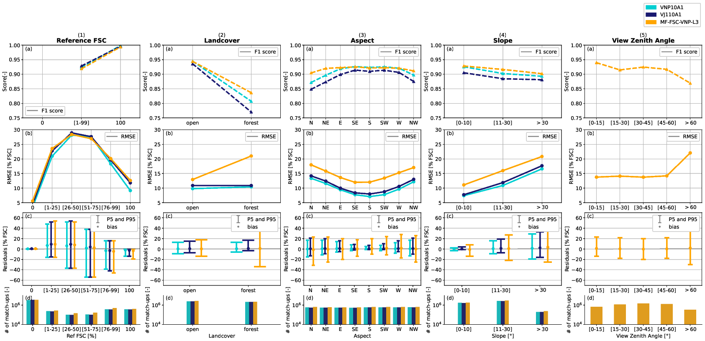
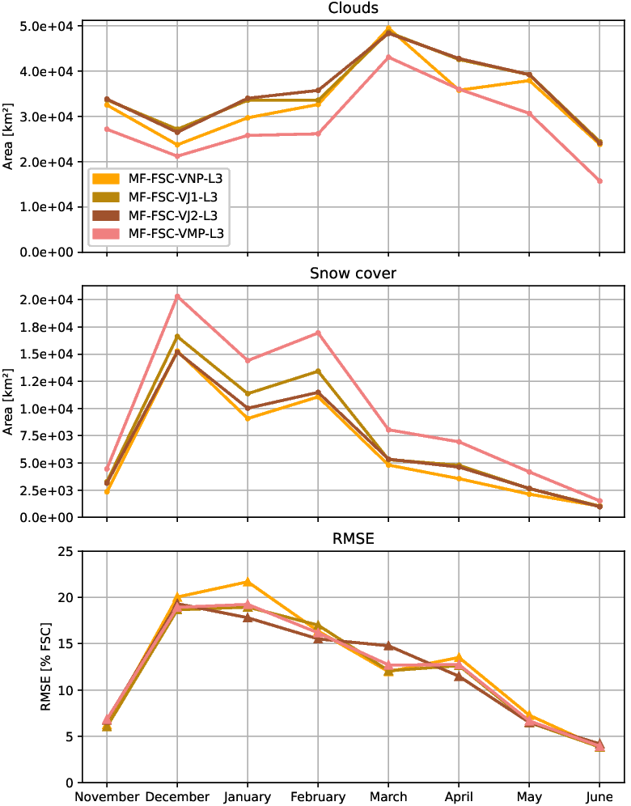
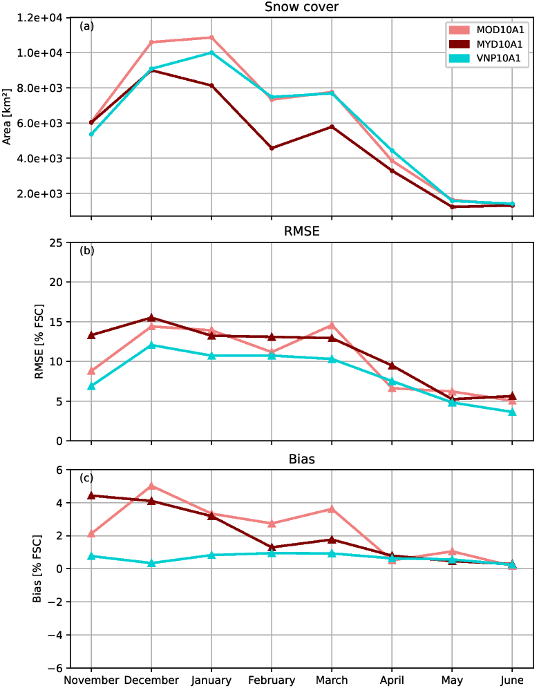
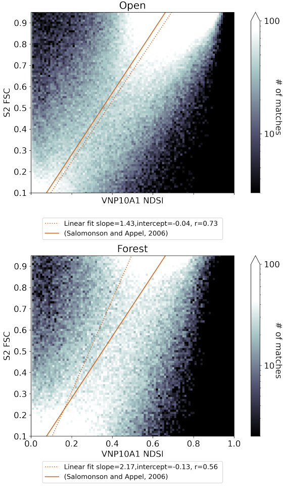

### Table of global scores


```python
import pandas as pd
from postprocess.error_distribution import compute_uncertainty_results_df, fancy_table_tot
from postprocess.general_purpose import open_reduced_dataset
from postprocess.skill_scores import compute_contingency_results_df, compute_n_pixels_results_df
from products.snow_cover_product import MeteoFranceEvalSNPP, VJ210A1, VNP10A1, VJ110A1
from winter_year import WinterYear
from geospatial_grid.grid_database import UTM375mGrid

product_list = [VNP10A1(), VJ110A1(), VJ210A1(), MeteoFranceEvalSNPP()]
winter_year = WinterYear(2023, 2024)
grid = UTM375mGrid()
analysis_folder = "/home/imperatoren/work/VIIRS_S2_comparison/viirsnow/output_folder/version_12/"
df_list = []
selection = dict(altitude_min=slice(900, None), time=slice("2023-11-01", "2024-06-30"))
uncertainty_list = [
    open_reduced_dataset(
        prod, analysis_folder=analysis_folder, winter_year=winter_year, analysis_type="uncertainty", grid=grid
    )
    .set_xindex("altitude_min")
    .sel(selection)
    for prod in product_list
]
confusion_table_list = [
    open_reduced_dataset(
        prod, analysis_folder=analysis_folder, winter_year=winter_year, analysis_type="confusion_table", grid=grid
    )
    .set_xindex("altitude_min")
    .sel(selection)
    for prod in product_list
]
df_cont = compute_contingency_results_df(snow_cover_products=product_list, metric_datasets=confusion_table_list)
df_unc = compute_uncertainty_results_df(snow_cover_products=product_list, metric_datasets=uncertainty_list)[["bias", "rmse"]]
df_n_pixels = compute_n_pixels_results_df(snow_cover_products=product_list, metric_datasets=confusion_table_list)[
    ["n_tot_pixels", "n_snow_pixels"]
]
df_n_pixels["percentage_snow_pixels"] = df_n_pixels["n_snow_pixels"] / df_n_pixels["n_tot_pixels"] * 100
df_n_pixels = df_n_pixels[["n_tot_pixels", "percentage_snow_pixels"]]

df_tot = pd.concat(
    [
        df_cont[["product"]],
        df_n_pixels,
        df_cont[["f1_score", "commission_error", "omission_error"]],
        df_unc,
    ],
    axis=1,
)


df_tot = df_tot.rename(
    columns={
        "product": "Product",
        "n_tot_pixels": "N pixels",
        "percentage_snow_pixels": "% Snow Cover",
        "f1_score": "F1-score",
        "commission_error": "Commission Error",
        "omission_error": "Omission Error",
        "bias": "Bias [%]",
        "rmse": "RMSE [%]",
    }
)


df_list.append(df_tot)


df_resume = pd.concat(df_list, ignore_index=True)


styled = fancy_table_tot(df_resume)

display(styled)
```


<style type="text/css">
#T_ca5fb th {
  background-color: lightgrey;
  color: black;
  font-weight: bold;
  width: 75px;
  text-align: center;
  text-usetex: True;
}
#T_ca5fb_row0_col0, #T_ca5fb_row0_col1, #T_ca5fb_row0_col2, #T_ca5fb_row1_col0, #T_ca5fb_row1_col1, #T_ca5fb_row1_col2, #T_ca5fb_row2_col0, #T_ca5fb_row2_col1, #T_ca5fb_row2_col2, #T_ca5fb_row3_col0, #T_ca5fb_row3_col1, #T_ca5fb_row3_col2 {
  align: center;
  text-align: center;
}
#T_ca5fb_row0_col3 {
  background-color: #7ac665;
  color: #000000;
  align: center;
  text-align: center;
}
#T_ca5fb_row0_col4 {
  background-color: #199750;
  color: #f1f1f1;
  align: center;
  text-align: center;
}
#T_ca5fb_row0_col5 {
  background-color: #b5df74;
  color: #000000;
  align: center;
  text-align: center;
}
#T_ca5fb_row0_col6, #T_ca5fb_row3_col6 {
  background-color: #2a814d;
  color: #f1f1f1;
  align: center;
  text-align: center;
}
#T_ca5fb_row0_col7, #T_ca5fb_row3_col3 {
  background-color: #69be63;
  color: #f1f1f1;
  align: center;
  text-align: center;
}
#T_ca5fb_row1_col3 {
  background-color: #96d268;
  color: #000000;
  align: center;
  text-align: center;
}
#T_ca5fb_row1_col4 {
  background-color: #3ca959;
  color: #f1f1f1;
  align: center;
  text-align: center;
}
#T_ca5fb_row1_col5 {
  background-color: #afdd70;
  color: #000000;
  align: center;
  text-align: center;
}
#T_ca5fb_row1_col6 {
  background-color: #529862;
  color: #f1f1f1;
  align: center;
  text-align: center;
}
#T_ca5fb_row1_col7 {
  background-color: #7dc765;
  color: #000000;
  align: center;
  text-align: center;
}
#T_ca5fb_row2_col3 {
  background-color: #82c966;
  color: #000000;
  align: center;
  text-align: center;
}
#T_ca5fb_row2_col4 {
  background-color: #148e4b;
  color: #f1f1f1;
  align: center;
  text-align: center;
}
#T_ca5fb_row2_col5 {
  background-color: #d7ee8a;
  color: #000000;
  align: center;
  text-align: center;
}
#T_ca5fb_row2_col6 {
  background-color: #026938;
  color: #f1f1f1;
  align: center;
  text-align: center;
}
#T_ca5fb_row2_col7 {
  background-color: #73c264;
  color: #000000;
  align: center;
  text-align: center;
}
#T_ca5fb_row3_col4 {
  background-color: #108647;
  color: #f1f1f1;
  align: center;
  text-align: center;
}
#T_ca5fb_row3_col5 {
  background-color: #cdea83;
  color: #000000;
  align: center;
  text-align: center;
}
#T_ca5fb_row3_col7 {
  background-color: #d3ec87;
  color: #000000;
  align: center;
  text-align: center;
}
</style>
<table id="T_ca5fb">
  <thead>
    <tr>
      <th id="T_ca5fb_level0_col0" class="col_heading level0 col0" >Product</th>
      <th id="T_ca5fb_level0_col1" class="col_heading level0 col1" >N pixels</th>
      <th id="T_ca5fb_level0_col2" class="col_heading level0 col2" >% Snow Cover</th>
      <th id="T_ca5fb_level0_col3" class="col_heading level0 col3" >F1-score</th>
      <th id="T_ca5fb_level0_col4" class="col_heading level0 col4" >Commission Error</th>
      <th id="T_ca5fb_level0_col5" class="col_heading level0 col5" >Omission Error</th>
      <th id="T_ca5fb_level0_col6" class="col_heading level0 col6" >Bias [%]</th>
      <th id="T_ca5fb_level0_col7" class="col_heading level0 col7" >RMSE [%]</th>
    </tr>
  </thead>
  <tbody>
    <tr>
      <td id="T_ca5fb_row0_col0" class="data row0 col0" >VNP10A1</td>
      <td id="T_ca5fb_row0_col1" class="data row0 col1" >4.48e+06</td>
      <td id="T_ca5fb_row0_col2" class="data row0 col2" >26.04</td>
      <td id="T_ca5fb_row0_col3" class="data row0 col3" >0.91</td>
      <td id="T_ca5fb_row0_col4" class="data row0 col4" >0.03</td>
      <td id="T_ca5fb_row0_col5" class="data row0 col5" >0.10</td>
      <td id="T_ca5fb_row0_col6" class="data row0 col6" >0.42</td>
      <td id="T_ca5fb_row0_col7" class="data row0 col7" >10.09</td>
    </tr>
    <tr>
      <td id="T_ca5fb_row1_col0" class="data row1 col0" >VJ110A1</td>
      <td id="T_ca5fb_row1_col1" class="data row1 col1" >4.45e+06</td>
      <td id="T_ca5fb_row1_col2" class="data row1 col2" >25.20</td>
      <td id="T_ca5fb_row1_col3" class="data row1 col3" >0.89</td>
      <td id="T_ca5fb_row1_col4" class="data row1 col4" >0.04</td>
      <td id="T_ca5fb_row1_col5" class="data row1 col5" >0.10</td>
      <td id="T_ca5fb_row1_col6" class="data row1 col6" >0.81</td>
      <td id="T_ca5fb_row1_col7" class="data row1 col7" >10.88</td>
    </tr>
    <tr>
      <td id="T_ca5fb_row2_col0" class="data row2 col0" >VJ210A1</td>
      <td id="T_ca5fb_row2_col1" class="data row2 col1" >4.68e+06</td>
      <td id="T_ca5fb_row2_col2" class="data row2 col2" >25.12</td>
      <td id="T_ca5fb_row2_col3" class="data row2 col3" >0.90</td>
      <td id="T_ca5fb_row2_col4" class="data row2 col4" >0.02</td>
      <td id="T_ca5fb_row2_col5" class="data row2 col5" >0.12</td>
      <td id="T_ca5fb_row2_col6" class="data row2 col6" >-0.02</td>
      <td id="T_ca5fb_row2_col7" class="data row2 col7" >10.57</td>
    </tr>
    <tr>
      <td id="T_ca5fb_row3_col0" class="data row3 col0" >MF-FSC-VNP-L3</td>
      <td id="T_ca5fb_row3_col1" class="data row3 col1" >4.89e+06</td>
      <td id="T_ca5fb_row3_col2" class="data row3 col2" >30.18</td>
      <td id="T_ca5fb_row3_col3" class="data row3 col3" >0.92</td>
      <td id="T_ca5fb_row3_col4" class="data row3 col4" >0.02</td>
      <td id="T_ca5fb_row3_col5" class="data row3 col5" >0.11</td>
      <td id="T_ca5fb_row3_col6" class="data row3 col6" >0.41</td>
      <td id="T_ca5fb_row3_col7" class="data row3 col7" >14.73</td>
    </tr>
  </tbody>
</table>


### Plot array of stratified analysis


```python
from typing import List
from matplotlib import pyplot as plt
from matplotlib.axes import Axes
from postprocess.error_distribution import line_plot_rmse, plot_error_bars
import matplotlib.patches as mpatches
from postprocess.skill_scores import barplot_total_count, line_plot_f1_score

from postprocess.general_purpose import AnalysisContainer
from products.snow_cover_product import MeteoFranceEvalSNPP

from copy import deepcopy
from products.snow_cover_product import MeteoFranceEvalSNPP, VNP10A1, VJ110A1, VJ210A1
from postprocess.general_purpose import AnalysisContainer
from winter_year import WinterYear
from geospatial_grid.grid_database import UTM375mGrid

numbers_alphabet_dict = {0: "(a)", 1: "(b)", 2: "(c)", 3: "(d)", 4: "(e)", 5: "(f)"}


def plot_one_var_analysis(analysis: AnalysisContainer, analysis_var: str, axs: List[Axes]):
    titles_dict = {
        "Ref FSC [%]": "Reference FSC",
        "Aspect": "Aspect",
        "Landcover": "Landcover",
        "Slope [°]": "Slope",
        "View Zenith Angle [°]": "View Zenith Angle",
    }

    axs[0].set_title(titles_dict[analysis_var], fontweight="bold")
    if analysis_var == "View Zenith Angle [°]":
        analysis_sza = deepcopy(analysis)
        analysis_sza.products = [MeteoFranceEvalSNPP()]
        analysis = analysis_sza
    line_plot_f1_score(analysis=analysis, analysis_var=analysis_var, ax=axs[0])
    line_plot_rmse(analysis=analysis, analysis_var=analysis_var, ax=axs[1])
    plot_error_bars(analysis=analysis, analysis_var=analysis_var, ax=axs[2])
    barplot_total_count(analysis=analysis, analysis_var=analysis_var, ax=axs[-1])


def plot_grid(analysis: AnalysisContainer, params_list: List[str], axs: List[Axes]):

    for i, var in enumerate(params_list):
        axs[0, i].text(
            0.5, 1.17, f"({i + 1})", horizontalalignment="center", verticalalignment="top", transform=axs[0, i].transAxes
        )
        for j in range(len(axs[:, i])):
            axs[j, i].text(
                0.02,
                0.98,
                numbers_alphabet_dict[j],
                horizontalalignment="left",
                verticalalignment="top",
                transform=axs[j, i].transAxes,
            )

        plot_one_var_analysis(analysis, var, axs[:, i])


analysis = AnalysisContainer(
    products=[VNP10A1(), VJ110A1(), MeteoFranceEvalSNPP()],
    analysis_folder="/home/imperatoren/work/VIIRS_S2_comparison/viirsnow/output_folder/version_12/",
    winter_year=WinterYear(2023, 2024),
    grid=UTM375mGrid(),
)

plt.rcParams["font.size"] = 13
params = ["Ref FSC [%]", "Landcover", "Aspect", "Slope [°]", "View Zenith Angle [°]"]
# params = ["Landcover","Aspect"]
fig, axs = plt.subplots(
    4, len(params), figsize=(5 * len(params), 11), layout="constrained", gridspec_kw={"height_ratios": [2, 2, 2, 0.8]}
)
# plot_grid(analysis=analysis, params_list=params, axs=axs)
custom_leg = [mpatches.Patch(color=product.plot_color, label=product.prod_id) for product in analysis.products]
fig.legend(handles=custom_leg, bbox_to_anchor=(1, 1.1))
fig.savefig(
    "/home/imperatoren/work/VIIRS_S2_comparison/article/viirs_paper/illustrations/fig04.eps",
    format="eps",
    bbox_inches="tight",
)
```

    WARNING:matplotlib.backends.backend_ps:The PostScript backend does not support transparency; partially transparent artists will be rendered opaque.


    

    


### Table of stratified error analysis for VNP10A1


```python
import pandas as pd

from postprocess.error_distribution import compute_uncertainty_results_df, fancy_table_tot
from postprocess.general_purpose import open_reduced_dataset
from postprocess.skill_scores import compute_contingency_results_df, compute_n_pixels_results_df
from products.snow_cover_product import VJ110A1, VNP10A1, MeteoFranceEvalSNPP

# import dataframe_image as dfi
from winter_year import WinterYear
from IPython.display import display

from products.snow_cover_product import VNP10A1
from geospatial_grid.grid_database import UTM375mGrid


analysis_folder = "/home/imperatoren/work/VIIRS_S2_comparison/viirsnow/output_folder/version_12/"

product_list = [VNP10A1()]
winter_year = WinterYear(2023, 2024)
grid = UTM375mGrid()
df_list = []

refs = ["1-99 \%", "0-100 \%"]

for i, ref in enumerate([slice(26, 100), slice(None, None)]):
    for f in ["forest", "open"]:
        for asp in ["N", "S"]:
            # for t in [ '2023-12',  '2024-04']:
            # print(f,asp,ref)
            selection = dict(
                altitude_min=slice(900, None), time=slice("2023-11-01", "2024-06-30"), ref_fsc_max=ref, landcover=f, aspect=asp
            )
            uncertainty_list = [
                open_reduced_dataset(
                    prod, analysis_folder=analysis_folder, analysis_type="uncertainty", winter_year=winter_year, grid=grid
                )
                .set_xindex("altitude_min")
                .set_xindex("ref_fsc_max")
                .sel(selection)
                for prod in product_list
            ]
            confusion_table_list = [
                open_reduced_dataset(
                    prod, analysis_folder=analysis_folder, analysis_type="confusion_table", winter_year=winter_year, grid=grid
                )
                .set_xindex("altitude_min")
                .set_xindex("ref_fsc_max")
                .sel(selection)
                for prod in product_list
            ]
            df_cont = compute_contingency_results_df(snow_cover_products=product_list, metric_datasets=confusion_table_list)
            df_cont["Reference FSC"] = refs[i]
            df_unc = compute_uncertainty_results_df(snow_cover_products=product_list, metric_datasets=uncertainty_list)[
                ["bias", "rmse"]
            ]
            df_n_pixels = compute_n_pixels_results_df(snow_cover_products=product_list, metric_datasets=confusion_table_list)[
                ["n_tot_pixels", "n_snow_pixels"]
            ]
            df_n_pixels["percentage_snow_pixels"] = df_n_pixels["n_snow_pixels"] / df_n_pixels["n_tot_pixels"] * 100
            df_n_pixels = df_n_pixels[["n_tot_pixels", "percentage_snow_pixels"]]

            df_tot = pd.concat(
                [
                    df_cont[["Reference FSC", "landcover", "aspect"]],
                    df_n_pixels,
                    df_cont[["f1_score", "commission_error", "omission_error"]],
                    df_unc,
                ],
                axis=1,
            )

            df_tot = df_tot.rename(
                columns={
                    "landcover": "Landcover",
                    "aspect": "Aspect",
                    "n_tot_pixels": "N pixels",
                    "percentage_snow_pixels": "% Snow Cover",
                    "f1_score": "F1-score",
                    "commission_error": "Commission Error",
                    "omission_error": "Omission Error",
                    "bias": "Bias [%]",
                    "rmse": "RMSE [%]",
                }
            )

            if df_tot.loc[0, "Landcover"] == "forest":
                df_tot["Landcover"] = "Forest"
            elif df_tot.loc[0, "Landcover"] == "no_forest":
                df_tot["Landcover"] = "Open"
            df_list.append(df_tot)
            # print(df_tot)
            # print("Worse")
            # fancy_table_skill_scores(df)


df_resume = pd.concat(df_list, ignore_index=True)
styled = fancy_table_tot(df_resume)

print("VNP10A1 2023/2024")
display(styled)
# dfi.export(styled, "/home/imperatoren/work/VIIRS_S2_comparison/article/illustrations/table_vnp10a1.pdf", table_conversion="selenium")
```

    <>:23: SyntaxWarning: invalid escape sequence '\%'
    <>:23: SyntaxWarning: invalid escape sequence '\%'
    <>:23: SyntaxWarning: invalid escape sequence '\%'
    <>:23: SyntaxWarning: invalid escape sequence '\%'
    /tmp/ipykernel_5388/312248034.py:23: SyntaxWarning: invalid escape sequence '\%'
      refs = ["1-99 \%", "0-100 \%"]
    /tmp/ipykernel_5388/312248034.py:23: SyntaxWarning: invalid escape sequence '\%'
      refs = ["1-99 \%", "0-100 \%"]


    VNP10A1 2023/2024


<style type="text/css">
#T_168c7 th {
  background-color: lightgrey;
  color: black;
  font-weight: bold;
  width: 75px;
  text-align: center;
  text-usetex: True;
}
#T_168c7_row0_col0, #T_168c7_row0_col1, #T_168c7_row0_col2, #T_168c7_row0_col3, #T_168c7_row0_col4, #T_168c7_row1_col0, #T_168c7_row1_col1, #T_168c7_row1_col2, #T_168c7_row1_col3, #T_168c7_row1_col4, #T_168c7_row2_col0, #T_168c7_row2_col1, #T_168c7_row2_col2, #T_168c7_row2_col3, #T_168c7_row2_col4, #T_168c7_row3_col0, #T_168c7_row3_col1, #T_168c7_row3_col2, #T_168c7_row3_col3, #T_168c7_row3_col4, #T_168c7_row4_col0, #T_168c7_row4_col1, #T_168c7_row4_col2, #T_168c7_row4_col3, #T_168c7_row4_col4, #T_168c7_row5_col0, #T_168c7_row5_col1, #T_168c7_row5_col2, #T_168c7_row5_col3, #T_168c7_row5_col4, #T_168c7_row6_col0, #T_168c7_row6_col1, #T_168c7_row6_col2, #T_168c7_row6_col3, #T_168c7_row6_col4, #T_168c7_row7_col0, #T_168c7_row7_col1, #T_168c7_row7_col2, #T_168c7_row7_col3, #T_168c7_row7_col4 {
  align: center;
  text-align: center;
}
#T_168c7_row0_col5, #T_168c7_row6_col9 {
  background-color: #afdd70;
  color: #000000;
  align: center;
  text-align: center;
}
#T_168c7_row0_col6, #T_168c7_row1_col6, #T_168c7_row2_col6, #T_168c7_row3_col6 {
  background-color: #000000;
  color: #f1f1f1;
  align: center;
  text-align: center;
}
#T_168c7_row0_col7 {
  background-color: #f88c51;
  color: #f1f1f1;
  align: center;
  text-align: center;
}
#T_168c7_row0_col8 {
  background-color: #8ebc82;
  color: #000000;
  align: center;
  text-align: center;
}
#T_168c7_row0_col9 {
  background-color: #a90426;
  color: #f1f1f1;
  align: center;
  text-align: center;
}
#T_168c7_row1_col5 {
  background-color: #a2d76a;
  color: #000000;
  align: center;
  text-align: center;
}
#T_168c7_row1_col7 {
  background-color: #fdad60;
  color: #000000;
  align: center;
  text-align: center;
}
#T_168c7_row1_col8 {
  background-color: #bdd89c;
  color: #000000;
  align: center;
  text-align: center;
}
#T_168c7_row1_col9, #T_168c7_row2_col9 {
  background-color: #fba05b;
  color: #000000;
  align: center;
  text-align: center;
}
#T_168c7_row2_col5 {
  background-color: #54b45f;
  color: #f1f1f1;
  align: center;
  text-align: center;
}
#T_168c7_row2_col7 {
  background-color: #e9f6a1;
  color: #000000;
  align: center;
  text-align: center;
}
#T_168c7_row2_col8 {
  background-color: #b1d195;
  color: #000000;
  align: center;
  text-align: center;
}
#T_168c7_row3_col5 {
  background-color: #4eb15d;
  color: #f1f1f1;
  align: center;
  text-align: center;
}
#T_168c7_row3_col7 {
  background-color: #e0f295;
  color: #000000;
  align: center;
  text-align: center;
}
#T_168c7_row3_col8 {
  background-color: #e1ac8d;
  color: #000000;
  align: center;
  text-align: center;
}
#T_168c7_row3_col9 {
  background-color: #fff8b4;
  color: #000000;
  align: center;
  text-align: center;
}
#T_168c7_row4_col5 {
  background-color: #fed481;
  color: #000000;
  align: center;
  text-align: center;
}
#T_168c7_row4_col6 {
  background-color: #7dc765;
  color: #000000;
  align: center;
  text-align: center;
}
#T_168c7_row4_col7 {
  background-color: #fdb768;
  color: #000000;
  align: center;
  text-align: center;
}
#T_168c7_row4_col8 {
  background-color: #2a814d;
  color: #f1f1f1;
  align: center;
  text-align: center;
}
#T_168c7_row4_col9 {
  background-color: #bde379;
  color: #000000;
  align: center;
  text-align: center;
}
#T_168c7_row5_col5 {
  background-color: #d1ec86;
  color: #000000;
  align: center;
  text-align: center;
}
#T_168c7_row5_col6 {
  background-color: #097940;
  color: #f1f1f1;
  align: center;
  text-align: center;
}
#T_168c7_row5_col7 {
  background-color: #feeb9d;
  color: #000000;
  align: center;
  text-align: center;
}
#T_168c7_row5_col8 {
  background-color: #0e703e;
  color: #f1f1f1;
  align: center;
  text-align: center;
}
#T_168c7_row5_col9 {
  background-color: #0e8245;
  color: #f1f1f1;
  align: center;
  text-align: center;
}
#T_168c7_row6_col5 {
  background-color: #3faa59;
  color: #f1f1f1;
  align: center;
  text-align: center;
}
#T_168c7_row6_col6 {
  background-color: #17934e;
  color: #f1f1f1;
  align: center;
  text-align: center;
}
#T_168c7_row6_col7 {
  background-color: #96d268;
  color: #000000;
  align: center;
  text-align: center;
}
#T_168c7_row6_col8 {
  background-color: #428f5a;
  color: #f1f1f1;
  align: center;
  text-align: center;
}
#T_168c7_row7_col5 {
  background-color: #42ac5a;
  color: #f1f1f1;
  align: center;
  text-align: center;
}
#T_168c7_row7_col6 {
  background-color: #0a7b41;
  color: #f1f1f1;
  align: center;
  text-align: center;
}
#T_168c7_row7_col7 {
  background-color: #98d368;
  color: #000000;
  align: center;
  text-align: center;
}
#T_168c7_row7_col8 {
  background-color: #3a8a56;
  color: #f1f1f1;
  align: center;
  text-align: center;
}
#T_168c7_row7_col9 {
  background-color: #18954f;
  color: #f1f1f1;
  align: center;
  text-align: center;
}
</style>
<table id="T_168c7">
  <thead>
    <tr>
      <th id="T_168c7_level0_col0" class="col_heading level0 col0" >Reference FSC</th>
      <th id="T_168c7_level0_col1" class="col_heading level0 col1" >Landcover</th>
      <th id="T_168c7_level0_col2" class="col_heading level0 col2" >Aspect</th>
      <th id="T_168c7_level0_col3" class="col_heading level0 col3" >N pixels</th>
      <th id="T_168c7_level0_col4" class="col_heading level0 col4" >% Snow Cover</th>
      <th id="T_168c7_level0_col5" class="col_heading level0 col5" >F1-score</th>
      <th id="T_168c7_level0_col6" class="col_heading level0 col6" >Commission Error</th>
      <th id="T_168c7_level0_col7" class="col_heading level0 col7" >Omission Error</th>
      <th id="T_168c7_level0_col8" class="col_heading level0 col8" >Bias [%]</th>
      <th id="T_168c7_level0_col9" class="col_heading level0 col9" >RMSE [%]</th>
    </tr>
  </thead>
  <tbody>
    <tr>
      <td id="T_168c7_row0_col0" class="data row0 col0" >1-99 \%</td>
      <td id="T_168c7_row0_col1" class="data row0 col1" >Forest</td>
      <td id="T_168c7_row0_col2" class="data row0 col2" >N</td>
      <td id="T_168c7_row0_col3" class="data row0 col3" >4.99e+04</td>
      <td id="T_168c7_row0_col4" class="data row0 col4" >100.00</td>
      <td id="T_168c7_row0_col5" class="data row0 col5" >0.87</td>
      <td id="T_168c7_row0_col6" class="data row0 col6" >nan</td>
      <td id="T_168c7_row0_col7" class="data row0 col7" >0.23</td>
      <td id="T_168c7_row0_col8" class="data row0 col8" >-1.38</td>
      <td id="T_168c7_row0_col9" class="data row0 col9" >29.72</td>
    </tr>
    <tr>
      <td id="T_168c7_row1_col0" class="data row1 col0" >1-99 \%</td>
      <td id="T_168c7_row1_col1" class="data row1 col1" >Forest</td>
      <td id="T_168c7_row1_col2" class="data row1 col2" >S</td>
      <td id="T_168c7_row1_col3" class="data row1 col3" >1.28e+04</td>
      <td id="T_168c7_row1_col4" class="data row1 col4" >100.00</td>
      <td id="T_168c7_row1_col5" class="data row1 col5" >0.88</td>
      <td id="T_168c7_row1_col6" class="data row1 col6" >nan</td>
      <td id="T_168c7_row1_col7" class="data row1 col7" >0.21</td>
      <td id="T_168c7_row1_col8" class="data row1 col8" >-1.86</td>
      <td id="T_168c7_row1_col9" class="data row1 col9" >22.97</td>
    </tr>
    <tr>
      <td id="T_168c7_row2_col0" class="data row2 col0" >1-99 \%</td>
      <td id="T_168c7_row2_col1" class="data row2 col1" >open</td>
      <td id="T_168c7_row2_col2" class="data row2 col2" >N</td>
      <td id="T_168c7_row2_col3" class="data row2 col3" >6.58e+04</td>
      <td id="T_168c7_row2_col4" class="data row2 col4" >100.00</td>
      <td id="T_168c7_row2_col5" class="data row2 col5" >0.93</td>
      <td id="T_168c7_row2_col6" class="data row2 col6" >nan</td>
      <td id="T_168c7_row2_col7" class="data row2 col7" >0.13</td>
      <td id="T_168c7_row2_col8" class="data row2 col8" >-1.74</td>
      <td id="T_168c7_row2_col9" class="data row2 col9" >23.06</td>
    </tr>
    <tr>
      <td id="T_168c7_row3_col0" class="data row3 col0" >1-99 \%</td>
      <td id="T_168c7_row3_col1" class="data row3 col1" >open</td>
      <td id="T_168c7_row3_col2" class="data row3 col2" >S</td>
      <td id="T_168c7_row3_col3" class="data row3 col3" >5.76e+04</td>
      <td id="T_168c7_row3_col4" class="data row3 col4" >100.00</td>
      <td id="T_168c7_row3_col5" class="data row3 col5" >0.93</td>
      <td id="T_168c7_row3_col6" class="data row3 col6" >nan</td>
      <td id="T_168c7_row3_col7" class="data row3 col7" >0.13</td>
      <td id="T_168c7_row3_col8" class="data row3 col8" >3.31</td>
      <td id="T_168c7_row3_col9" class="data row3 col9" >18.01</td>
    </tr>
    <tr>
      <td id="T_168c7_row4_col0" class="data row4 col0" >0-100 \%</td>
      <td id="T_168c7_row4_col1" class="data row4 col1" >Forest</td>
      <td id="T_168c7_row4_col2" class="data row4 col2" >N</td>
      <td id="T_168c7_row4_col3" class="data row4 col3" >3.18e+05</td>
      <td id="T_168c7_row4_col4" class="data row4 col4" >17.88</td>
      <td id="T_168c7_row4_col5" class="data row4 col5" >0.75</td>
      <td id="T_168c7_row4_col6" class="data row4 col6" >0.07</td>
      <td id="T_168c7_row4_col7" class="data row4 col7" >0.20</td>
      <td id="T_168c7_row4_col8" class="data row4 col8" >0.42</td>
      <td id="T_168c7_row4_col9" class="data row4 col9" >13.63</td>
    </tr>
    <tr>
      <td id="T_168c7_row5_col0" class="data row5 col0" >0-100 \%</td>
      <td id="T_168c7_row5_col1" class="data row5 col1" >Forest</td>
      <td id="T_168c7_row5_col2" class="data row5 col2" >S</td>
      <td id="T_168c7_row5_col3" class="data row5 col3" >2.02e+05</td>
      <td id="T_168c7_row5_col4" class="data row5 col4" >7.88</td>
      <td id="T_168c7_row5_col5" class="data row5 col5" >0.85</td>
      <td id="T_168c7_row5_col6" class="data row5 col6" >0.01</td>
      <td id="T_168c7_row5_col7" class="data row5 col7" >0.17</td>
      <td id="T_168c7_row5_col8" class="data row5 col8" >-0.13</td>
      <td id="T_168c7_row5_col9" class="data row5 col9" >6.42</td>
    </tr>
    <tr>
      <td id="T_168c7_row6_col0" class="data row6 col0" >0-100 \%</td>
      <td id="T_168c7_row6_col1" class="data row6 col1" >open</td>
      <td id="T_168c7_row6_col2" class="data row6 col2" >N</td>
      <td id="T_168c7_row6_col3" class="data row6 col3" >2.44e+05</td>
      <td id="T_168c7_row6_col4" class="data row6 col4" >44.71</td>
      <td id="T_168c7_row6_col5" class="data row6 col5" >0.94</td>
      <td id="T_168c7_row6_col6" class="data row6 col6" >0.03</td>
      <td id="T_168c7_row6_col7" class="data row6 col7" >0.08</td>
      <td id="T_168c7_row6_col8" class="data row6 col8" >-0.64</td>
      <td id="T_168c7_row6_col9" class="data row6 col9" >13.00</td>
    </tr>
    <tr>
      <td id="T_168c7_row7_col0" class="data row7 col0" >0-100 \%</td>
      <td id="T_168c7_row7_col1" class="data row7 col1" >open</td>
      <td id="T_168c7_row7_col2" class="data row7 col2" >S</td>
      <td id="T_168c7_row7_col3" class="data row7 col3" >3.69e+05</td>
      <td id="T_168c7_row7_col4" class="data row7 col4" >23.63</td>
      <td id="T_168c7_row7_col5" class="data row7 col5" >0.94</td>
      <td id="T_168c7_row7_col6" class="data row7 col6" >0.01</td>
      <td id="T_168c7_row7_col7" class="data row7 col7" >0.08</td>
      <td id="T_168c7_row7_col8" class="data row7 col8" >0.55</td>
      <td id="T_168c7_row7_col9" class="data row7 col9" >7.43</td>
    </tr>
  </tbody>
</table>


### VIIRS mult-platform fusion


```python
from products.snow_cover_product import MeteoFranceEvalSNPP, MeteoFranceEvalJPSS1, MeteoFranceEvalJPSS2, MeteoFranceComposite
from matplotlib import pyplot as plt
from winter_year import WinterYear
from geospatial_grid.grid_database import UTM375mGrid
from postprocess.general_purpose import AnalysisContainer
import matplotlib.patches as patches
from postprocess.class_distribution import annual_area_fancy_plot

plt.rcParams["font.size"] = 10

analysis_folder = "/home/imperatoren/work/VIIRS_S2_comparison/viirsnow/output_folder/version_12/"
product_list = [MeteoFranceEvalSNPP(), MeteoFranceEvalJPSS1(), MeteoFranceEvalJPSS2(), MeteoFranceComposite()]
analysis = AnalysisContainer(
    products=product_list, analysis_folder=analysis_folder, winter_year=WinterYear(2024, 2025), grid=UTM375mGrid()
)

c = ["clouds", "snow_cover"]
s = ["rmse"]
n_classes = len(c)
n_scores = len(s)
n_tot = n_classes + n_scores
fig, axs = plt.subplots(n_tot, figsize=(7, 3 * n_tot), sharex=True, layout="constrained")

custom_leg = [patches.Patch(color=product.plot_color, label=product.prod_id) for product in analysis.products]
product_legend = axs[0].legend(handles=custom_leg, fontsize=10)
axs[0].add_artist(product_legend)

annual_area_fancy_plot(analysis=analysis, classes=c, scores=s, axes=axs)
fig.show()
fig.patch.set_alpha(0.0)
fig.savefig("/home/imperatoren/work/VIIRS_S2_comparison/article/fig05.eps", format="eps", bbox_inches="tight")
```

    /tmp/ipykernel_5388/1343916069.py:29: UserWarning: FigureCanvasAgg is non-interactive, and thus cannot be shown
      fig.show()
    WARNING:matplotlib.backends.backend_ps:The PostScript backend does not support transparency; partially transparent artists will be rendered opaque.


    

    


### Comparison of VIIRS and MODIS


```python
from matplotlib import patches

from postprocess.class_distribution import annual_area_fancy_plot
from products.snow_cover_product import MOD10A1, VNP10A1, MYD10A1
from regrid.modis_l3_to_time_series import UTM500mGrid
from winter_year import WinterYear
from postprocess.general_purpose import AnalysisContainer
import matplotlib.pyplot as plt

plt.rcParams["font.size"] = 10

analysis_folder = "/home/imperatoren/work/VIIRS_S2_comparison/viirsnow/output_folder/version_12/"
analysis = AnalysisContainer(
    products=[MOD10A1(), MYD10A1(), VNP10A1()],
    analysis_folder=analysis_folder,
    winter_year=WinterYear(2023, 2024),
    grid=UTM500mGrid(),
)

c = ["snow_cover"]
s = ["rmse", "bias"]
n_classes = len(c)
n_scores = len(s)
n_tot = n_classes + n_scores
fig, axs = plt.subplots(n_tot, figsize=(7, 3 * n_tot), sharex=True, layout="constrained")

custom_leg = [patches.Patch(color=product.plot_color, label=product.prod_id) for product in analysis.products]
product_legend = axs[0].legend(handles=custom_leg, fontsize=9)
axs[0].add_artist(product_legend)

annual_area_fancy_plot(analysis=analysis, classes=c, scores=s, axes=axs)
fig.show()
fig.savefig(
    "/home/imperatoren/work/VIIRS_S2_comparison/article/viirs_paper/illustrations/fig06.png",
    format="png",
    bbox_inches="tight",
    dpi=30,
)
```

    /tmp/ipykernel_5388/326848599.py:32: UserWarning: FigureCanvasAgg is non-interactive, and thus cannot be shown
      fig.show()


    

    


### Scatter plot and fit for NDSI-FSC conversion VNP10A1


```python
### NDSI-FSC regression
from matplotlib import cm, colors
from matplotlib.axes import Axes
from matplotlib.figure import Figure
import numpy as np
from fractional_snow_cover import gascoin, salomonson_appel

# from postprocess.scatter_plot import fancy_scatter_plot
import xarray as xr
import matplotlib.pyplot as plt
from ndsi_fsc_calibration.visualization import scatter_plot_with_fit

plt.rcParams["font.size"] = 15
analysis_type = "scatter"
analysis_folder = (
    "/home/imperatoren/work/VIIRS_S2_comparison/viirsnow/output_folder/version_12/wy_2023_2024/vnp10a1_utm_375m/analyses/"
)

nasa_l3_snpp_metrics_ds = xr.open_dataset(f"{analysis_folder}/scatter.nc")
nasa_l3_snpp_metrics_ds = nasa_l3_snpp_metrics_ds.rename({"ref_fsc_min": "fsc", "eval_bins": "ndsi"}).swap_dims(
    {"ref_fsc_bins": "fsc"}
)

fig, ax = plt.subplots(2, 1, figsize=(7, 12), sharex=True, layout="constrained")
# plt.subplots_adjust(bottom=-0.15)


FOREST_TITLE = {
    "open": "Open",
    "forest": "Forest",
}
for i, fore in enumerate(["open", "forest"]):
    n_min = 0
    # fig.suptitle("VNP10A1 NDSI_Snow_Cover vs Reference FSC (Sentinel-2)", fontsize=14)
    reduced = (
        nasa_l3_snpp_metrics_ds.sel(landcover=[fore])
        .sum(dim=("landcover", "time", "altitude_bins", "aspect"))
        .data_vars["n_occurrences"]
    )

    xax = reduced.ndsi.values / 100
    f_veg = 0 if fore == "open" else 0.5
    scatter_plot = scatter_plot_with_fit(
        data=reduced,
        eval_prod_name="VNP10A1",
        ax=ax[i],
        fig=fig,
        quantile_min=0.2,
        quantile_max=0.9,
        fsc_min=10,
        fsc_max=95,
    )
    ax[i].set_title(f"{FOREST_TITLE[fore]}")


plt.show()


fig.patch.set_alpha(0.0)
fig.savefig("/home/imperatoren/work/VIIRS_S2_comparison/article/viirs_paper/illustrations/fig07.png", format="png", dpi=300)
```


    

    


### Estimation of gain in terms of snow cover area for multiplatform composite


```python
import xarray as xr
from postprocess.general_purpose import open_reduced_dataset, AnalysisContainer
from products.snow_cover_product import MeteoFranceEvalSNPP, MeteoFranceComposite, MeteoFranceEvalJPSS1, MeteoFranceEvalJPSS2
import numpy as np

product_list = [MeteoFranceEvalSNPP(), MeteoFranceEvalJPSS1(), MeteoFranceEvalJPSS2(), MeteoFranceComposite()]
analysis_folder = "/home/imperatoren/work/VIIRS_S2_comparison/viirsnow/output_folder/version_12/"

analysis = AnalysisContainer(
    products=product_list, analysis_folder=analysis_folder, winter_year=WinterYear(2024, 2025), grid=UTM375mGrid()
)

ds_list = []
for prod in analysis.products:
    ds_list.append(
        open_reduced_dataset(
            product=prod,
            analysis_folder=analysis.analysis_folder,
            analysis_type="completeness",
            winter_year=analysis.winter_year,
            grid=analysis.grid,
        ).set_xindex("altitude_min")
    )

metrics_dataset_completeness_0 = open_reduced_dataset(
    product=analysis.products[0],
    analysis_folder=analysis.analysis_folder,
    analysis_type="completeness",
    winter_year=analysis.winter_year,
    grid=analysis.grid,
)
common_days = metrics_dataset_completeness_0.coords["time"]
for prod in analysis.products[1:]:
    metrics_dataset_completeness = open_reduced_dataset(
        product=prod,
        analysis_folder=analysis.analysis_folder,
        analysis_type="completeness",
        winter_year=analysis.winter_year,
        grid=analysis.grid,
    )
    common_days = np.intersect1d(common_days, metrics_dataset_completeness.coords["time"])

snow_cover_areas = []
for prod, ds in zip(analysis.products, ds_list):
    snow_cover_areas.append(
        ds.data_vars["surface"]
        .sel(time=common_days, class_name="snow_cover", altitude_min=slice(900, None))
        .sum(dim=("altitude_bins", "time", "landcover"))
        .values
    )

print("Snow cover increase from SNPP to multiplatform")
print((snow_cover_areas[3] - snow_cover_areas[0]) / snow_cover_areas[0] * 100)
print("Snow cover increase from JPSS-1 to multiplatform")
print((snow_cover_areas[3] - snow_cover_areas[1]) / snow_cover_areas[1] * 100)
print("Snow cover increase from JPSS-2 to multiplatform")
print((snow_cover_areas[3] - snow_cover_areas[2]) / snow_cover_areas[2] * 100)
```

    Snow cover increase from SNPP to multiplatform
    55.32780710998792
    Snow cover increase from JPSS-1 to multiplatform
    31.300721244049956
    Snow cover increase from JPSS-2 to multiplatform
    43.20870006724115


### Estimation of reduction of cloud cover for multiplatform composite


```python
import xarray as xr
from postprocess.general_purpose import open_reduced_dataset, AnalysisContainer
from products.snow_cover_product import MeteoFranceEvalSNPP, MeteoFranceComposite, MeteoFranceEvalJPSS1, MeteoFranceEvalJPSS2
import numpy as np

product_list = [MeteoFranceEvalSNPP(), MeteoFranceEvalJPSS1(), MeteoFranceEvalJPSS2(), MeteoFranceComposite()]
analysis_folder = "/home/imperatoren/work/VIIRS_S2_comparison/viirsnow/output_folder/version_12/"
analysis = AnalysisContainer(
    products=product_list, analysis_folder=analysis_folder, winter_year=WinterYear(2024, 2025), grid=UTM375mGrid()
)
ds_list = []
for prod in analysis.products:
    ds_list.append(
        open_reduced_dataset(
            product=prod,
            analysis_folder=analysis.analysis_folder,
            analysis_type="completeness",
            winter_year=analysis.winter_year,
            grid=analysis.grid,
        ).set_xindex("altitude_min")
    )

metrics_dataset_completeness_0 = open_reduced_dataset(
    product=analysis.products[0],
    analysis_folder=analysis.analysis_folder,
    analysis_type="completeness",
    winter_year=analysis.winter_year,
    grid=analysis.grid,
)
common_days = metrics_dataset_completeness_0.coords["time"]
for prod in analysis.products[1:]:
    metrics_dataset_completeness = open_reduced_dataset(
        product=prod,
        analysis_folder=analysis.analysis_folder,
        analysis_type="completeness",
        winter_year=analysis.winter_year,
        grid=analysis.grid,
    )
    common_days = np.intersect1d(common_days, metrics_dataset_completeness.coords["time"])

cloud_cover_areas = []
for prod, ds in zip(analysis.products, ds_list):
    cloud_cover_areas.append(
        ds.data_vars["surface"]
        .sel(time=common_days, class_name="clouds", altitude_min=slice(900, None))
        .sum(dim=("altitude_bins", "time", "landcover"))
        .values
    )

print("Cloud cover decrease from SNPP to multiplatform")
print((cloud_cover_areas[0] - cloud_cover_areas[3]) / cloud_cover_areas[0] * 100)
print("Cloud cover decrease from JPSS-1 to multiplatform")
print((cloud_cover_areas[1] - cloud_cover_areas[3]) / cloud_cover_areas[1] * 100)
print("Cloud cover decrease from JPSS-2 to multiplatform")
print((cloud_cover_areas[2] - cloud_cover_areas[3]) / cloud_cover_areas[2] * 100)
```

    Cloud cover decrease from SNPP to multiplatform
    16.645674662275216
    Cloud cover decrease from JPSS-1 to multiplatform
    22.13275638807397
    Cloud cover decrease from JPSS-2 to multiplatform
    22.37437954165714

